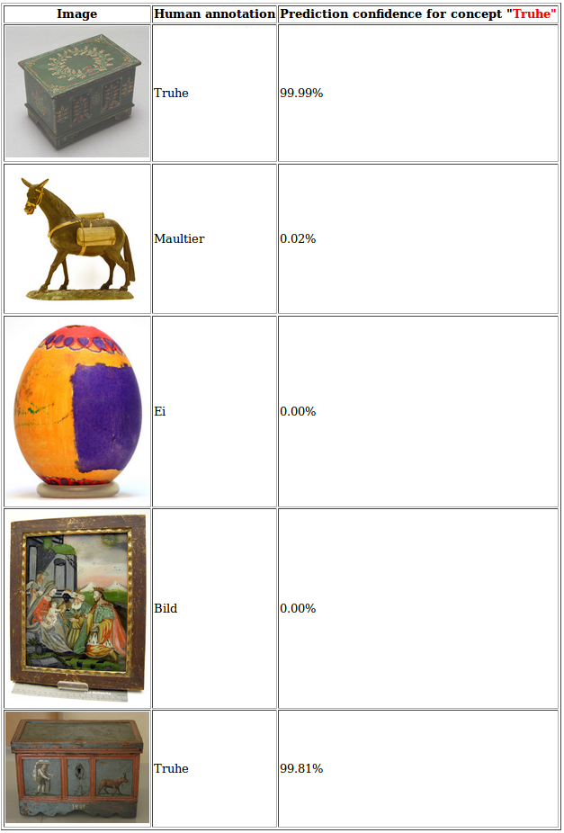

# khclass

## Introduction

*khclass* is an image classifier demo application created during the "Kulturhackathon" in St. Pölten, 21st to 23rd of September 2017.
 
It is a django web application demo which makes use of the Clarifai API for image classification. It is required to register at
https://clarifai.com to get an API token needed to do Clarifai API calls.

The images of the test data set have been provided by the Volkskundemuseum Wien (http://www.volkskundemuseum.at). There are 57 images 
in test set "test1" and 47 images in test set "test2" available in the "static/images" folder.

In each of the test set folders, there is a "train.csv" file which contains annotations (in German) for the training data set and a 
"predict.csv" used to predict the class. 

The following screenshot shows the result of the question "To what degree is the object on the image representative for the concept
"Truhe" (engl. "coffer", "footlocker").

In this sense, the value in the column "Prediction confidence" means the degree of "cofferness" or "footlockerness" of the corresponding 
image in the leftmost column.

## Installation

1. Checkout project

        git clone https://github.com/shsdev/khclass
        
    And then change to the 'khclass' directory:

        cd khclass
    
2. Create virtual environment (python)

    Install virtual environment python packages (requires pip: https://pypi.python.org/pypi/pip):

        sudo pip install virtualenv
        sudo pip install virtualenvwrapper

    Create a directory for your virtual environments and set the environment variable (e.g. in your ~/.bashrc):

        mkdir ~/Envs
        export WORKON_HOME=~/Envs
        source /usr/local/bin/virtualenvwrapper.sh

    Create a virtual environment (e.g. named khclass) to install python packages separately from the default python installation.
    
        mkvirtualenv khclass
        
    If the virtual environment is active, this is shown by a prefix in the console (type `workon khclass` otherwise):
    
        (khclass)user@machine:~$

4. Install python packages:

        pip install -r requirements.txt
        
5. Prepare Django database (Creates an SQLite file based database)

        python manage.py migrate

## Usage

### Adapt configuration settings

The Clarifai API token must be defined in the settings file (parameter 'clarifai_api_key'):

    khclass/settings.cfg
    
There are default settings for other parameters which can be adapted if desired:

* clarifai_api_key: Clarify API token (you need to be registered at https://clarifai.com to get an API key)
* data_dir: Data directory which coincides with the static file directory of Django
* test_set_id: The images directory can contain a series of test sets distinguished by a numeric suffix
* test_concept: In this demo only one concept can be trained and predicted (e.g. Truhe)
* concept_column: Currently, there are two tag columns, "tag1" and "tag2" in the "train.csv" files. 
* clarifai_model_prefix: Prefix of the model name (test set ID is appended to the model name)
    
By default, the training and prediction data set is stored in the "static" folder which is also used by Django to deliver image files.

### Create the model

To create the classification model use the following command:

    python khclarifai/khclarify_train.py
    
which will create a model where the model name is determined by the "clarifai_model_prefix" and "test_set_id" parameters, e.g. by default:

    Model created: mymodel1

### Run prediction and display results

Start Django server:

    python manage.py runserver
    
Open browser at and click on the "Demo" link which will execute the prediction on the prediction set:

    http://127.0.0.1:8000
    
It will take a few seconds until the table with the results is shown because the prediction is executed when the page is loaded.

In this demo, the model is trained for a single test concept which is defined in the configuration file. The same concept is 
used for predicting the degree of confidence that the concept is representative for the image. To run the prediction on a new concept, a new model
has to be trained for this concept first. I.e. change the value of 'test_concept' in 'config/settings.cfg', run the training module
'khclarifai/khclarify_train.py', and then you can run the prediction for the new test concept.

## License

Licensed under GNU GENERAL PUBLIC LICENSE Version 3 available at https://www.gnu.org/licenses/gpl-3.0.txt.
